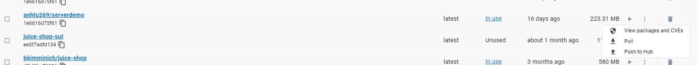
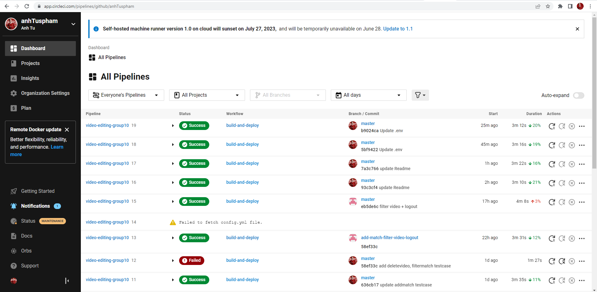
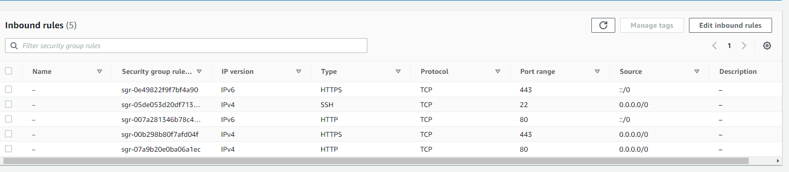
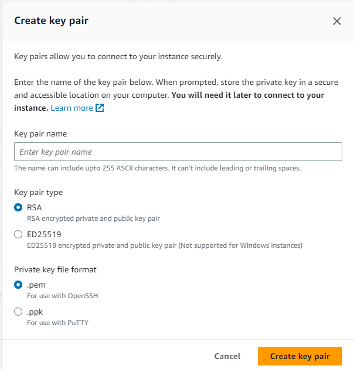
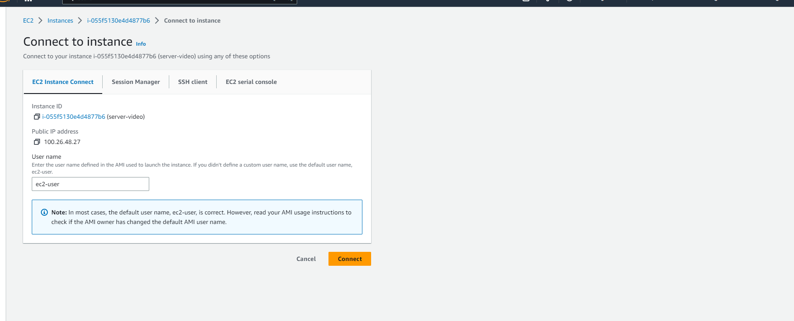
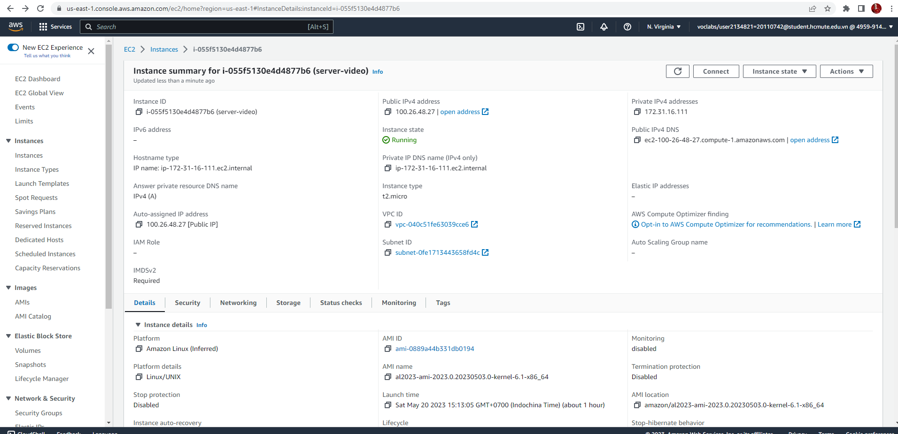
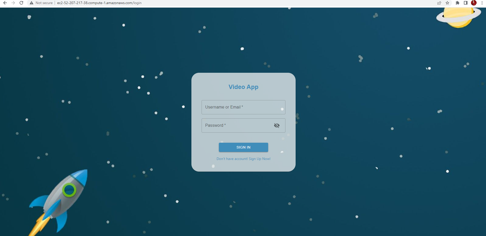
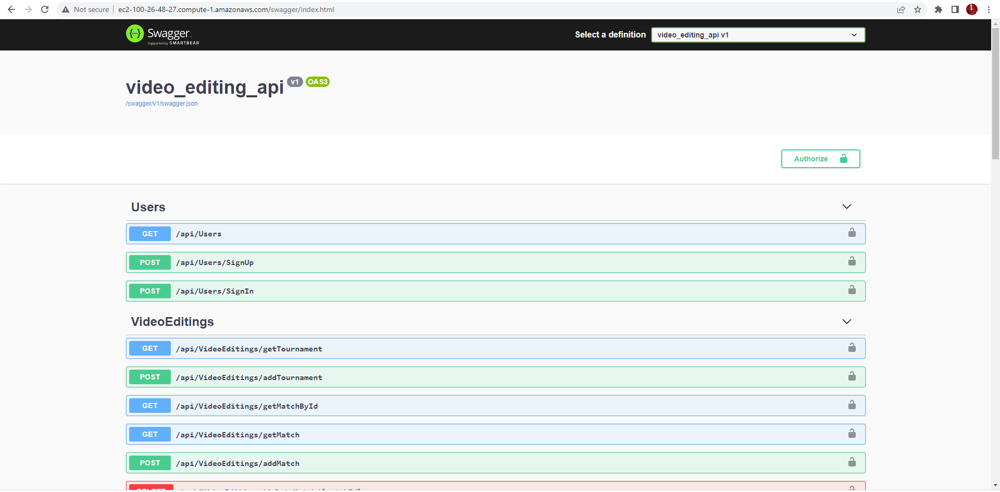
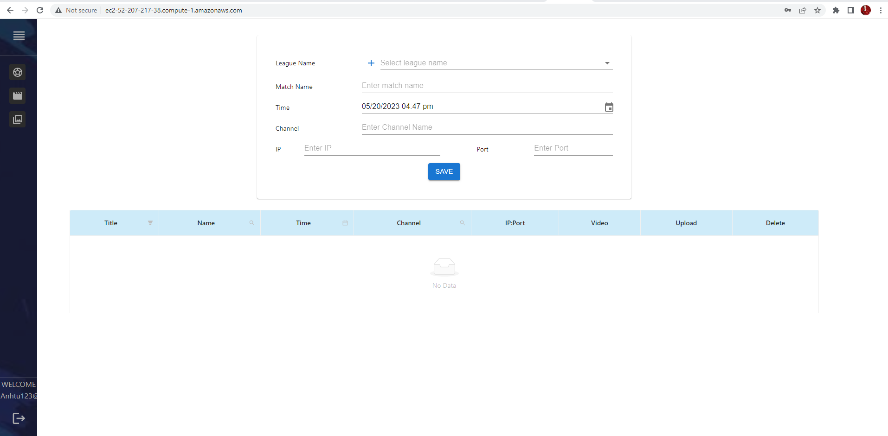

# Nhóm 10

1. Phạm Anh Tú 20110742
2. Võ Đinh Quốc Thuật 20110733
3. Bùi Hào Quang 20110703


## Cài đặt và chạy project 
 ### Deploy bằng docker lên localhost
 1. Clone project về máy
    - Vào thư mục cần chứa project gõ
   ``` 
    git clone https://github.com/anhTuspham/video-editing-group10.git
   ```
 2. Build image của server và client lên docker
    - Mở docker desktop 
    - Build image của server
        - Vào project, và mở terminal, gõ
      
      ```
      cd server
      cd video-editing-api
      docker build -t anhtu269/server-docker -f video-editing-api/Dockerfile .
      ```
        - Sau khi build thành công màn hình sẽ hiển thị, gõ tiếp câu lệnh
      
      ```
      docker run -it -p 5001:80 anhtu269/server-docker
      ```
      
    - Sau khi build xong vào chrome gõ 
   ```
   http://localhost:5001/swagger/index.html
   ```
   
   - Build image của client
      - Vào thư mục chứa file docker-compose, gõ
     ```
     docker-compose up
     ```
     
   
      - Lên chrome gõ
   ```
   http://localhost:5002/
   ```
   Vậy là thành công
   ### Deploy lên AWS
1. Vào thư mục chứa project, mở cmd gõ 
   ```
   cd .\server\
   cd .\video-editing-api\
   docker build -t anhtu269/serverdemo -f video-editing-api/Dockerfile .
   ```
   để tiến hành build dockerfile của server cho project
2. Sau đó push image serverdemo mới build lên dockerhub, để có thể sử dụng trên môi trường cloud, vào docker desktop vào image 
   
3. Tiếp theo tiến hành vào trang https://circleci.com/signup/ để tạo account circleci để build project trên các môi trường khác nhau, ở đây là dùng để xây dựng trên môi trường đám mây aws

   
   tiến hành build project với file config.yml
4. Truy cập vào aws learner lab, vào ec2,đầu tiên ta tạo security group
   - Trước tiên ta vào phần Network & security, chọn security group, chọn create Security group
   - Đặt tên security, tại phần Inbound rule, nhấn add Inbound rules và thêm giống như ảnh bên dưới
   
   - Sau đó nhấn create security
5. Tạo tài khoản EC2 instance trên aws
   - Nhấn chọn launch instance để tạo instance mới
   - Đặt tên cho instance và chọn 64 bit(x86) ở phần architecture
   - Tại phần Key pair, nhấn create new key pair,nhập tên và để mặc định các lựa chọn rồi nhấn create key pair
   
   - Tại phần network setting, ta chọn Select existing security group, và chọn security group vừa tạo ở bước 4, sau đó nhấn Launch instance
6. Connect ec2 instance
   - Click vào instance vừa tạo
   - Nhấn vào connect màn hình sẽ hiện ra như bên dưới và nhấn connect lần nữa để vào terminal của ec2 instance
   
   - **Deploy front-end:**
   - Ta tiến hành gõ các câu lệnh sau vào terminal
   ```
   sudo -i
   sudo yum update -y
   sudo yum install docker -y
   sudo service docker start
   docker -v
   docker pull anhtu269/videoanalysis:latest
   docker images
   docker run -it -p 80:80 anhtu269/videoanalysis:latest
   ```
   - Trong đó thì anhtu269/videoanalysis:latest là image đã up lên docker hub, này là tùy theo tên image bạn đã build
     sau đó tiến hành run docker bằng lệnh
     docker run -it -p 80:80 anhtu269/videoanalysis:latest
     sau đó vào lại instance vừa tạo, tìm Public IPv4 DNS
   
   - Vào link chỉnh thành http thay vì https, sau đó load lại để tới client của project
     Sau khi load thành công màn hình sẽ hiện ra như thế này
   
   - **Deploy server lên aws:**
   - Đối với server của project làm tương tự với 1 ec2 instance khác, tại phần pull image
     lần này sẽ pull image của server, dùng lệnh
     ```
     docker pull anhtu269/serverdemo:latest
     docker run -it -p 80:80 anhtu269/serverdemo 
     ```
   - Vẫn vào lại instance vừa tạo, tìm Public IPv4 DNS
     
   - Thay https thành http, thêm đuôi swagger/index.html sau aws.com
     và lúc đó ta đã load được server project và ta sẽ được server trên aws
   
- Sau khi run client và server lên aws, thử tạo một tài khoản xem server đã kết nối với client chưa.

- Đây là màn hình khi đăng nhập thành công

