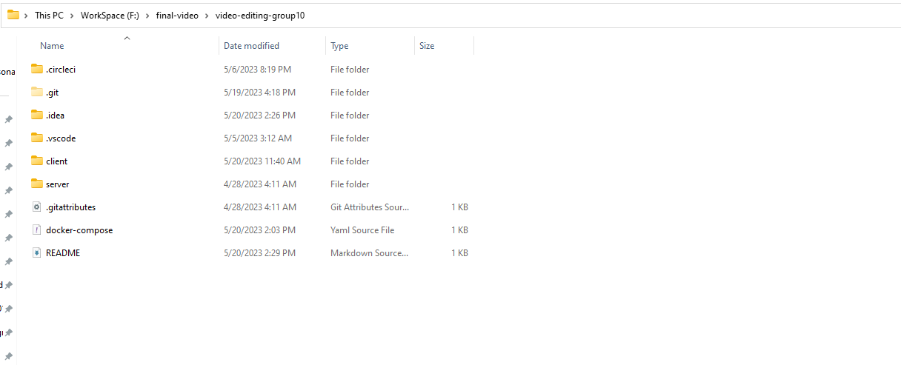

# Nhóm 10

1. Phạm Anh Tú 20110742
2. Võ Đinh Quốc Thuật 20110733
3. Bùi Hào Quang 20110703


## Cài đặt và chạy project 
 ### Deploy bằng docker lên localhost
1. Clone project về máy
    - Vào thư mục cần chứa project gõ
   ``` 
    git clone https://github.com/anhTuspham/video-editing-group10.git
   ```
2. Build image của server và client lên docker
    - Mở docker desktop 
    - Build image của server
        - Vào project, và mở terminal, gõ
      
      ```
      cd server
      cd video-editing-api
      docker build -t anhtu269/server-docker -f video-editing-api/Dockerfile .
      ```
        - Sau khi build thành công màn hình sẽ hiển thị, gõ tiếp câu lệnh
      
      ```
      docker run -it -p 5001:80 anhtu269/server-docker
      ```
      
    - Sau khi build xong vào chrome gõ 
   ```
   http://localhost:5001/swagger/index.html
   ```
   
   - Build image của client
      - Vào thư mục chứa file docker-compose, gõ
     ```
     docker-compose up
     ```
     
   